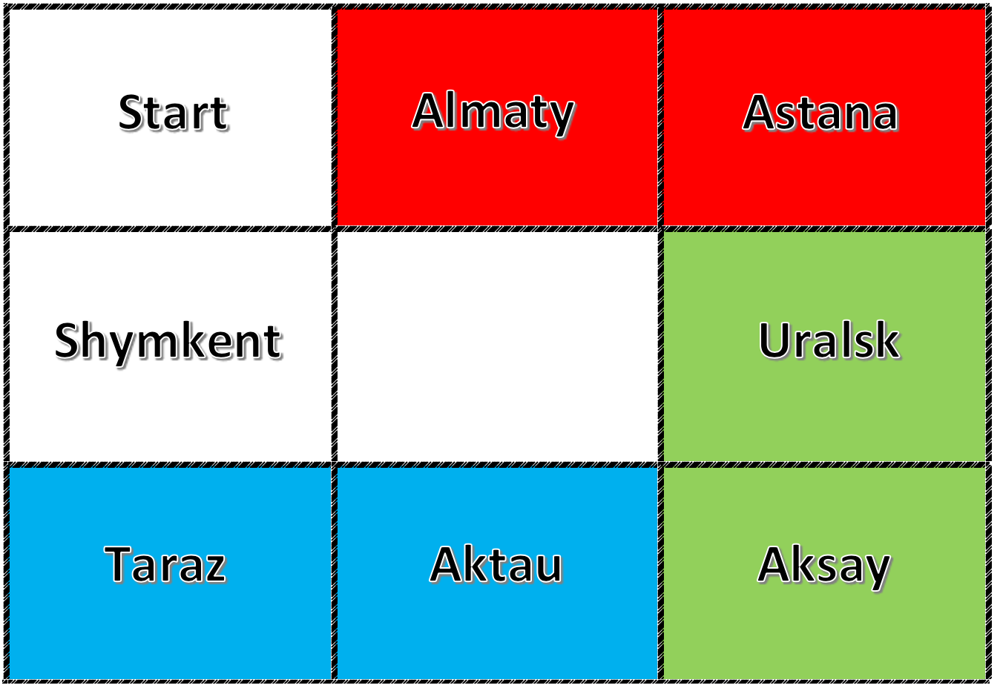

# nFactorial-Monopoly-Test
## Привет, это работа для школы программирования n!

Игра монополия. 
В своей работе я успешно реализовал:
- Регистрацию пользователей
- Создание карты
- Определение позиции каждого игрока
- Проверку хода
- Принцип ООП

  

Карта разделена на 8 блоков, где
- 1 блок является Стартовым

- Каждый круг дает игрокам по 500 000 kzt
- При попадании игрока на занятый блок, он обязана выплатить 500 000 kzt

Made by: Alikhan Gubayev
Telegram: @akidra4L
